# RTBase

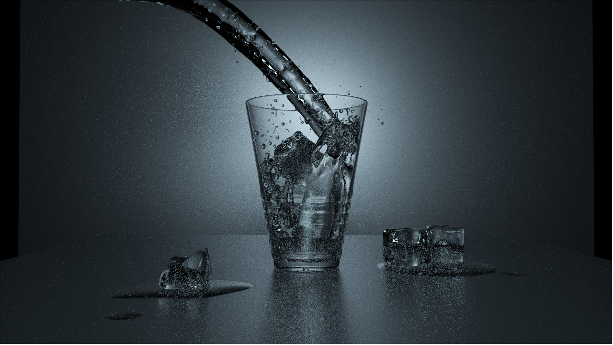
*Glass of Water scene rendered at 128 SPP, demonstrating Glass BSDF and Throwbridge-Reitz (GGX) Conductor BSDF implementations.*

## Overview
An extended CPU-based multithreaded, Physically Based Renderer written in C++, built to explore light transport and material models. The core architecture supports standard Path Tracing, alongside Instant Radiosity and Light Tracing rendering algorithms. The material framework handles GGX Microfacets (sampled proportionally to the NDF), Oren-Nayar, Plastic (Phong Model), Diffuse, Mirror, Glass, and Layered BSDFs (featuring Beer's Law). Render times and variance are managed via Bounding Volume Hierarchy with Binned Surface Area Heuristics, tile-based rendering, Multiple Importance Sampling, and custom AOVs (Arbitrary Output Variables) to support Intel OIDN for denoising.

## Project Structure

```
Renderer/
│── Core.h                  # Core mathematical and utility functions
│── Renderer.h              # Main ray tracing logic
│── Sampling.h              # Monte Carlo sampling utilities
│── Scene.h                 # Scene representation and camera logic
│── SceneLoader.h           # Loads scenes and configurations
│── Lights.h                # Light source definitions
│── Geometry.h              # Geometric structures and operations
│── Imaging.h               # Image generation and storage
│── Materials.h             # Materials and shading models
│── GEMLoader.h             # External loader for scene assets
│── GamesEngineeringBase.h  # Base utilities for integration
```

## Features & Implementation Details

### Light Transport & Sampling
* **Path Tracing:** Standard unidirectional integrator with Multiple Importance Sampling.
* **Instant Radiosity:** Computes indirect illumination via Virtual Point Lights, utilizing a **quasi-Monte Carlo sequence with Halton Sampling**, relying on prime bases for the Radical Inverse (van Der Corput Sequence).
* **Light Tracing:** Traces paths originating from light sources, improving convergence for specific light paths.
* **Environment Mapping:** Latitude-Longitude Environment Maps evaluated, and sampled using a luminance-based PDF, combined with MIS to reduce variance.

### Physically Based Materials (BSDFs)
* **Conductor BSDF (GGX Microfacet):** Both evaluation and sampling are proportional to the Normal Distribution Function (NDF).
* **Diffuse, Mirror (Perfect Specular), Glass & Plastic (Phong) BSDFs.**
* **Oren-Nayar BSDF:** Accurate diffuse simulation for rough opaque surfaces.
* **Layered BSDF:** Supports complex multi-layer materials and implements **Beer's Law** for attenuation.

### Performance & Optimizations
* **Binned SAH BVH:** Bounding Volume Hierarchy utilizing a Binned Surface Area Heuristic to optimally partition geometry.
* **Tile-Based Multithreading:** Concurrent processing of image tiles across available CPU threads.
* **Intel Open Image Denoise (OIDN):** Generation of custom Arbitrary Output Variables (AOVs) to feed the OIDN pipeline, achieving high-quality images at drastically reduced sample counts.

---

## Renders & Comparisons

### Integrator Comparison
Evaluating identical Cornell Box scenes across the three implemented light transport algorithms.

| Path Tracing | Light Tracing | Instant Radiosity |
|:---:|:---:|:---:|
| 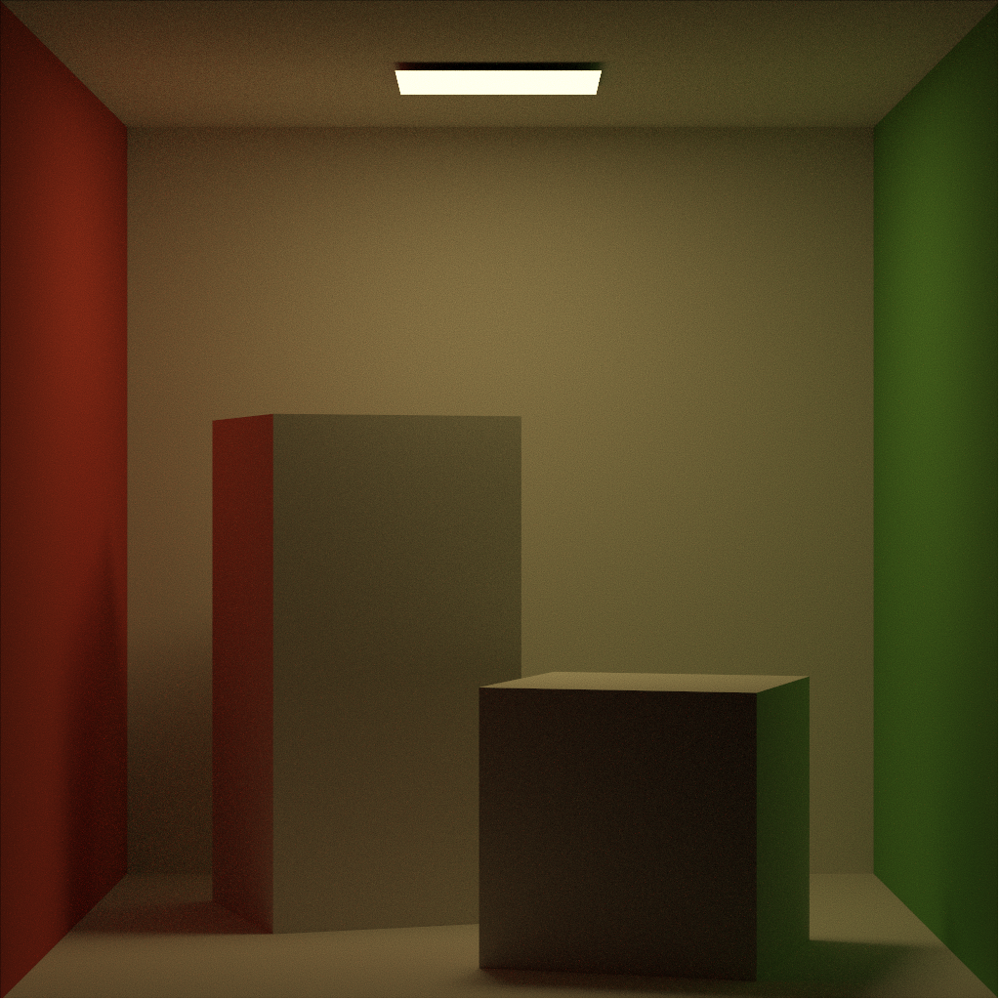 | 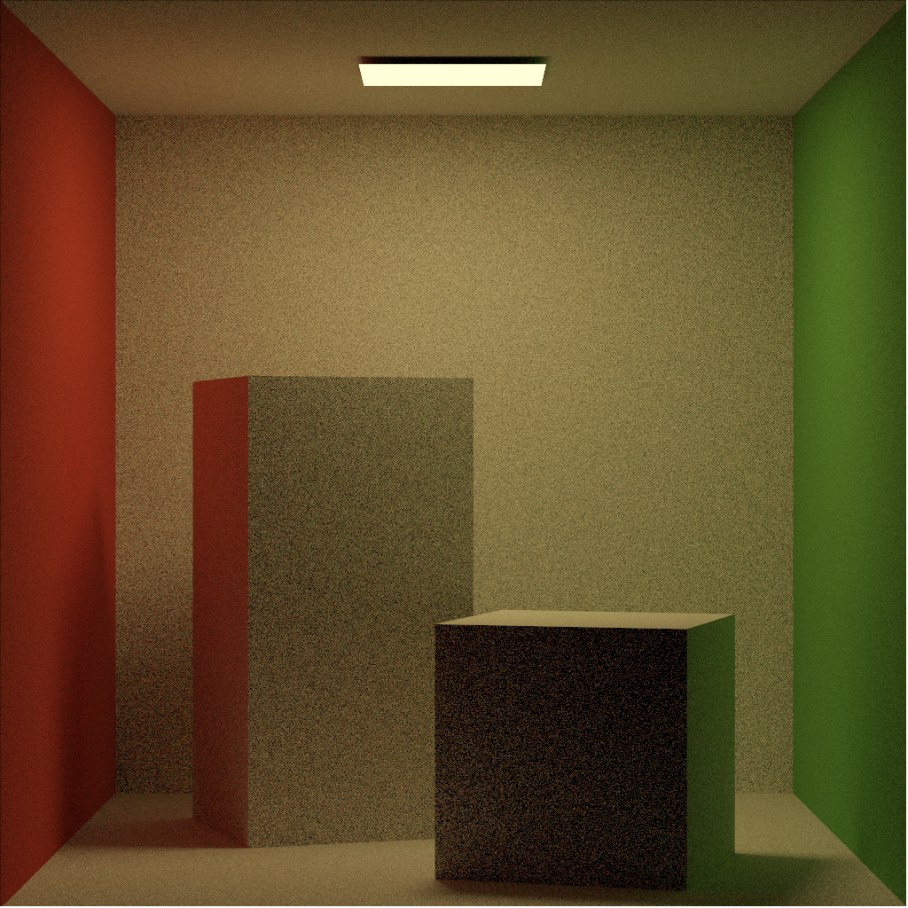 | 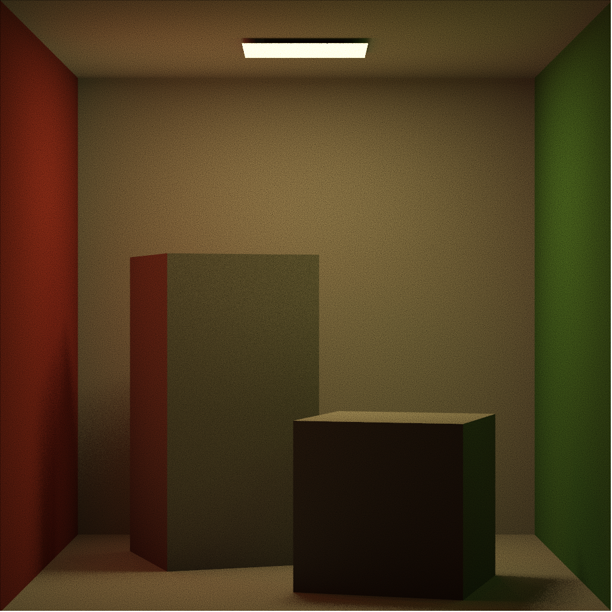 |
| *Standard path tracing.* | *Paths traced from light sources.* | *Halton-sampled Virtual Point Lights.* |

### Variance Reduction via AI Denoising (Intel OIDN)
Comparing raw outputs at 128 Samples Per Pixel (SPP) against 16 SPP outputs processed through Intel OIDN using custom AOV passes.

| 128 SPP (Raw / Noisy) | 16 SPP (Denoised via OIDN) |
|:---:|:---:|
| 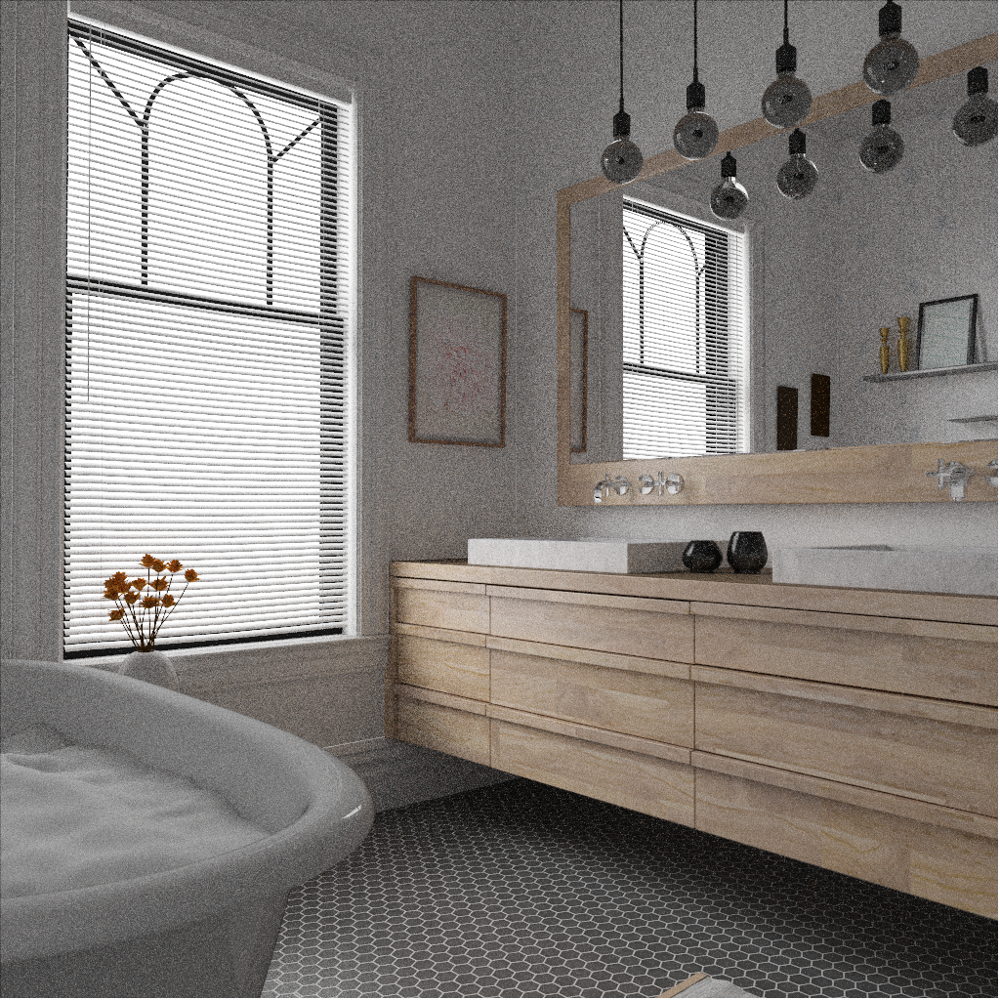 | 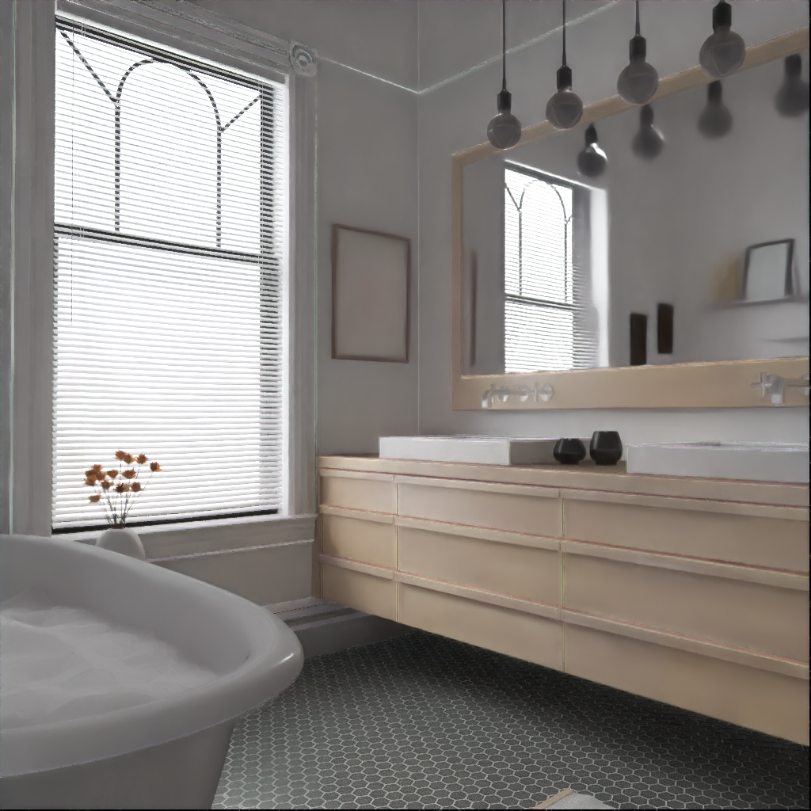 |
| 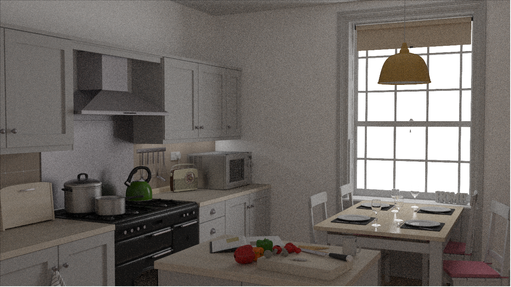 |  |
| 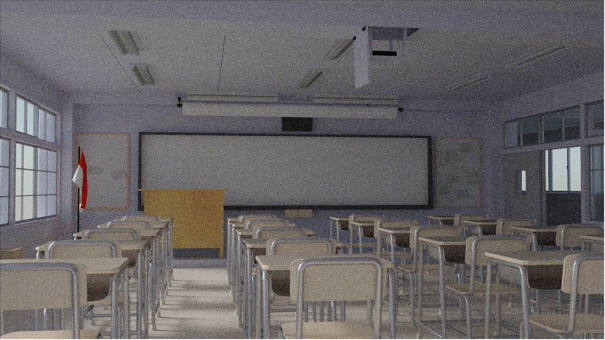 | 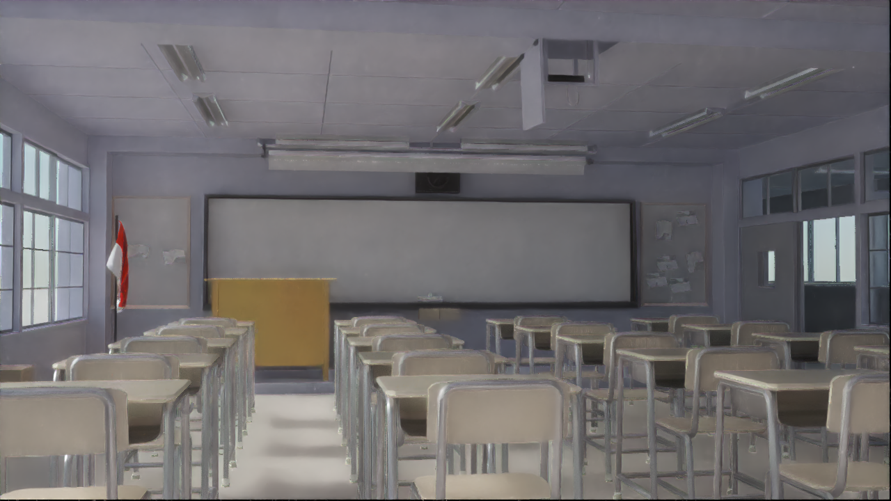 |
| 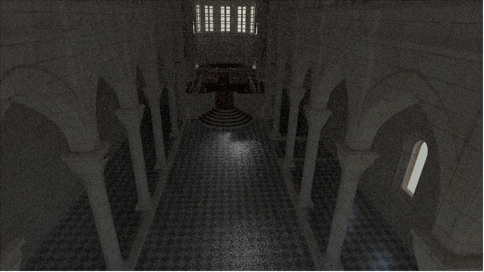 | 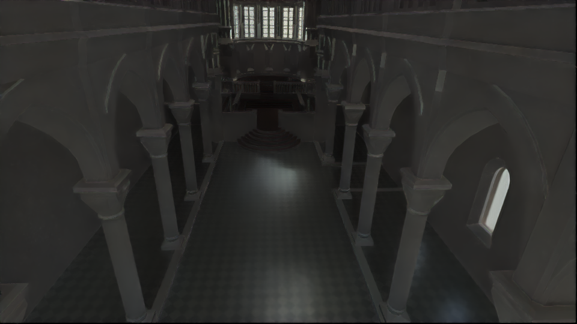 |

*(Note: Classroom and Sibenik scenes also evaluate Latitude-Longitude Environment Map lighting).*

### Material Implementations

**Layered BSDF Evaluation**
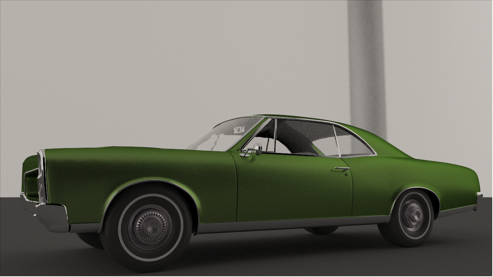
*Car model rendered at 128 SPP testing the Layered BSDF implementation.*

**BSDF Lineup & Environment Map**

*Left to right: Demonstrating various implemented BSDFs (Oren-Nayar, Conductor, Plastic, Glass, Mirror, Oren-Nayar) under an environment map sampled using a luminance-based PDF.*
